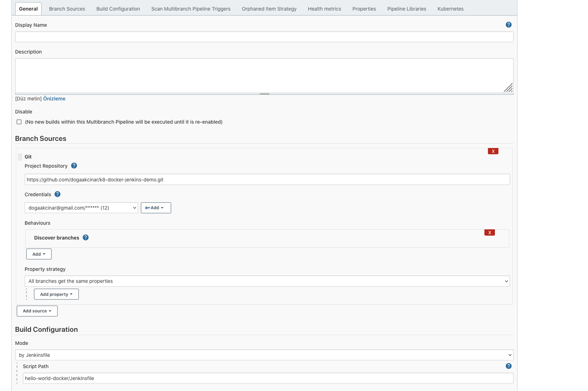

# K8, Jenkins, Docker Demo

## Steps

- Creating neccesary resources on GCP via terraform (vm, fw rules, ssh key). We will create 3 nodes in Google Cloud 2 of them are for k8 other one is for Jenkins and Docker
- 2 node Kubernetes installiation with kubespray
- Jenkins, docker installiaton with ansible playbook
- Hello world app written in Node.js express library
- Creating Jenkins pipeline for hello world app and deploy it to existing k8 cluster via helm. 


#### Prerequisites

* To follow this tutorial you need Python , [Ansible](https://docs.ansible.com/ansible/latest/installation_guide/intro_installation.html) installed on your localhost and a Google Cloud Platform Account.


# Installation Steps

### Google Cloud Resources
<br />

1-  Create [project](https://cloud.google.com/resource-manager/docs/creating-managing-projects) in GCP.<br />
2- [Create service account](https://cloud.google.com/iam/docs/creating-managing-service-accounts)  and download in json format GCP. (it contains sensitive data so do not commit it anywhere.) 

3- Create [ssh key pair](https://www.ssh.com/academy/ssh/keygen).

4- Replace terraform-files/main.tf with your credential, gcp project name , ssh-public key variables respectively.

```sh
credentials = file("yourCredential")
project     = "yourProject"
ssh-keys = "demouser:${file("yourpublicKey")}"
```
5- Now we are ready to create resources on GCP. Run the following command. 

```sh
ansible-playbook --tags create-resources-gcp ansible-playbooks/site.yml
```

### Kubernetes install
<br />
In this section we wil install kubernetes to our nodes via kubespray, first we clone the kubespray repository with ansible and copy inventory file.

1-  Following command will clone the kubespray repo and prepare inventory file.
```sh
ansible-playbook --tags prepare-k8-cluster ansible-playbooks/site.yml
```
2- Replace the ip variables in ansible-playbooks/hosts.yaml <br />

3- Run the following command to deploy kubernetes cluster to nodes. This will take approx. 15 min

```sh
ansible-playbook -i ansible-playbooks/hosts.yaml --private-key="yourPrivateKey"  --become --become-user=root ansible-playbooks/site.yml
```

### Jenkins - Docker Install
Below command will install docker and Jenkins to our node3. After playbook succesfully completes, Jenkins will serve 8080 port on node3 ip. Also command output contains Jenkins initialadminpassword. With that password you can setup Jenkins in ui

```sh
ansible-playbook -i ansible-playbooks/hosts.yaml --private-key="yourPrivateKey"  --become --become-user=root ansible-playbooks/site.yml
```

### Jenkins Pipeline Creation

After Jenkins setup create a credential with yout github account and create new multibranch pipeline, use the configuration below.


- With multibranch pipeline, when a new code added to the this repo a job will be triggered automatically, new image will built and pushes to local docker registry with jenkins build number version, and Helm will deploy new image to K8 cluster like below.
  
  